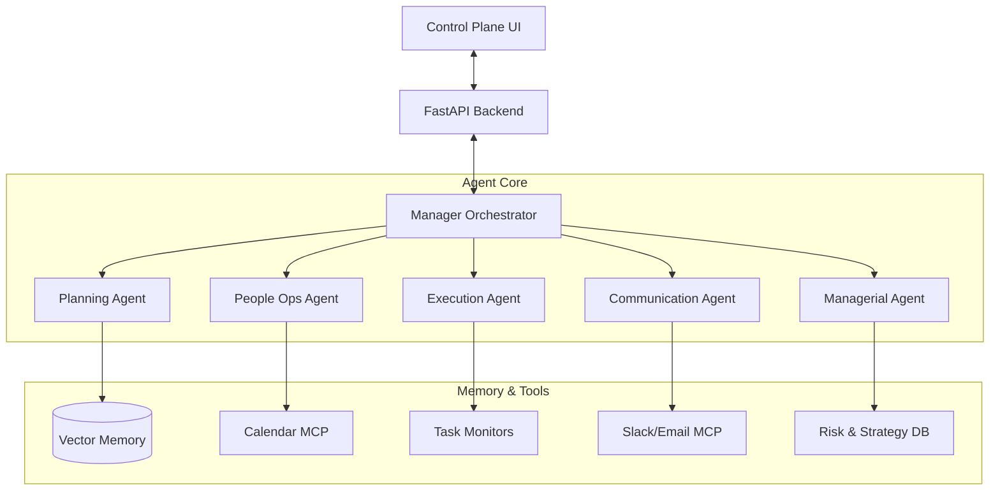

# Virtual AI Manager (VAM)


## 🌟 Vision

The **Virtual AI Manager (VAM)** is an autonomous managerial system designed to operate continuously alongside human teams. Unlike requested-response chatbots, VAM proactively plans, monitors, and executes management tasks—scheduling meetings, approving leave, tracking deadlines, and reporting progress—while keeping humans in the loop via a dedicated control plane.

## 🏗 System Architecture

VAM operates on a multi-agent architecture using **LangGraph** for orchestration and **MCP (Model Context Protocol)** for tool integration.



## ✨ Key Features

- **🧠 Autonomous Planning**: Decomposes high-level goals (e.g., "Launch Marketing Campaign") into actionable steps and dependency graphs.
- **🤝 People Operations**: Handles leave requests with approval rationale, detects burnout risks, and manages skills/meetings.
- **📈 Growth & Scaling**: Manages hiring pipelines, generates 30-60-90 day onboarding plans, and curates internal knowledge bases.
- **👁️ Active Monitoring**: Continuously watches task statuses and proactively flags risks before deadlines are missed.
- **📊 Analytics & Automation**: Data-driven insights, risk forecasting, executive dashboards, and proactive suggestions.
- **� Managerial Intelligence**: Provides strategic risk analysis, goal refinement, and automates standups/reporting.
- **�🛡️ Human Control Plane**: A "God Mode" dashboard to observe agent thought processes in real-time and intervene/override actions instantly.
- **🔌 Deep Integration**: Built on MCP to plug into Google Calendar, Slack, GitHub, and Jira without custom glue code.

## 🚀 Getting Started

### Prerequisites

- **Python** 3.10+
- **Node.js** 18+
- **Git**

### Installation

1. **Clone the repository**
   ```bash
   git clone https://github.com/agusain2001/Virtual-manager.git
   cd Virtual-manager
   ```

2. **Backend Setup**
   ```bash
   cd backend
   python -m venv venv
   # Windows
   ./venv/Scripts/Activate.ps1
   # Linux/Mac
   # source venv/bin/activate
   
   pip install -r requirements.txt
   ```
   
3. **Frontend Setup**
   ```bash
   cd ../frontend
   npm install
   ```

### Running the System

**1. Start the Brain (Backend)**
```bash
cd backend
uvicorn app.main:app --reload
```
API runs on: `http://localhost:8000`

**2. Start the Control Plane (Frontend)**
```bash
cd frontend
npm run dev
```
Dashboard runs on: `http://localhost:3000`

## 📂 Project Structure

```
Virtual-manager/
├── backend/                 # Python/FastAPI Agent Core
│   ├── app/
│   │   ├── agents/          # Agent Logic (Orchestrator, Planning, Execution, Managerial, etc.)
│   │   ├── core/            # Config, Database, Logging, Memory
│   │   ├── mcp/             # Model Context Protocol Tool Servers
│   │   ├── routers/         # API Endpoints (Goals, Projects, Managerial, etc.)
│   │   ├── services/        # Business Logic (Monitoring, Milestones)
│   │   └── main.py          # API Entry Point
│   └── requirements.txt
│
├── frontend/                # Next.js Control Plane
│   ├── src/
│   │   ├── app/             # Pages & Layouts
│   │   └── components/      # UI Components (VAMDashboard, ManagerialDashboard, etc.)
│   └── package.json
│
├── AGENTS.md                # Detailed Agent Documentation
└── README.md                # Project Overview
```

## 🤝 Contributing

This is an MVP implementation. We welcome contributions to expand agent capabilities!
1. Fork the repo.
2. Create your feature branch (`git checkout -b feature/AmazingFeature`).
3. Commit your changes.
4. Push to the branch.
5. Open a Pull Request.

## 📄 License

Distributed under the MIT License.
