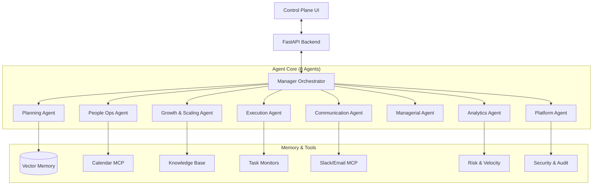

# Virtual AI Manager (VAM)


## 🌟 Vision

The **Virtual AI Manager (VAM)** is an autonomous managerial system designed to operate continuously alongside human teams. Unlike request-response chatbots, VAM proactively plans, monitors, and executes management tasks—scheduling meetings, approving leave, tracking deadlines, forecasting risks, and reporting progress—while keeping humans in the loop via a dedicated control plane.

## 🏗 System Architecture

VAM operates on a multi-agent architecture using **LangGraph** for orchestration and **MCP (Model Context Protocol)** for tool integration.



## ✨ Key Features (Phases 1-6 Complete)

### Phase 1-2: Core Foundation & Managerial Intelligence
- **🧠 Autonomous Planning**: Decomposes goals into actionable DAGs with dependency tracking
- **📋 Task & Project Management**: Full lifecycle management with milestones and goals
- **🐙 GitHub Integration**: Bi-directional sync with GitHub Issues, OAuth login, and webhook automation
- **👁️ Active Monitoring**: Proactive risk detection and deadline tracking
- **📊 Managerial Intelligence**: Strategic risk analysis, goal refinement, automated reporting

### Phase 3: Human-Centric Intelligence
- **🤝 People Operations**: Leave management, burnout detection, skill matrices
- **📅 Calendar Integration**: Working hours, time zones, meeting scheduling
- **⚖️ Capacity Planning**: `get_available_hours()`, `check_overload()` functions
- **🔥 Burnout Watchdog**: Sustained overload and deadline pressure monitoring

### Phase 4: Growth Intelligence
- **📈 Hiring Pipeline**: Candidate tracking with automated resume scoring
- **✅ Interview Management**: Scheduling, feedback collection, offer workflows
- **🎯 Onboarding**: 30-60-90 day plans with auto-generated tasks
- **📚 Knowledge Base**: Internal documentation with role-based curation

### Phase 5: Analytics & Automation
- **📉 Velocity Tracking**: Task completion trends and projected dates
- **⚠️ Risk Scoring**: Weighted algorithm (overdue × 5, blocked × 3, load × 10)
- **📊 Executive Dashboards**: Goal + project + risk summaries
- **🤖 Automation Rules**: IFTTT triggers for proactive interventions
- **📸 Project Snapshots**: Historical metrics for trend analysis
- **🔮 AI Forecasting**: Completion predictions with confidence scores

### Phase 6: Platform & Enterprise Readiness
- **🔐 RBAC**: Role-based access (Admin, Manager, Contributor, Viewer)
- **📝 Audit Logging**: Immutable logs with AI prompt/response capture
- **✅ Approval Workflows**: Sensitive actions require human approval
- **🏢 Multi-Tenancy**: Data isolation with subscription tiers
- **🔌 MCP Tool Registry**: Dynamic tool discovery with safety gates
- **🔄 Circuit Breaker**: Auto-disables failing tools after 5 errors

## 🚀 Getting Started

### Prerequisites

- **Python** 3.10+
- **Node.js** 18+
- **Git**
- **GitHub OAuth App** (Client ID & Secret)

### Installation

1. **Clone the repository**
   ```bash
   git clone https://github.com/agusain2001/Virtual-manager.git
   cd Virtual-manager
   ```

2. **Backend Setup**
   ```bash
   cd backend
   python -m venv venv
   # Windows
   ./venv/Scripts/Activate.ps1
   # Linux/Mac
   # source venv/bin/activate
   
   pip install -r requirements.txt
   
   # Configure Environment
   cp .env.example .env
   # Edit .env with your GitHub Client ID/Secret and DB settings
   ```
   
3. **Frontend Setup**
   ```bash
   cd ../frontend
   npm install
   ```

### Running the System

**1. Start the Brain (Backend)**
```bash
cd backend
uvicorn backend.app.main:app --reload
```
API runs on: `http://localhost:8000`

**2. Start the Control Plane (Frontend)**
```bash
cd frontend
npm run dev
```
Dashboard runs on: `http://localhost:3000`

## 📂 Project Structure

```
Virtual-manager/
├── backend/                     # Python/FastAPI Agent Core
│   ├── app/
│   │   ├── agents/              # 8 Specialized Agents
│   │   │   ├── orchestrator.py      # Manager Orchestrator (LangGraph)
│   │   │   ├── planning.py          # Task decomposition & DAGs
│   │   │   ├── execution.py         # Monitoring & escalation
│   │   │   ├── people_ops.py        # HR & capacity (1400+ lines)
│   │   │   ├── growth_scaling.py    # Hiring & onboarding (800+ lines)
│   │   │   ├── analytics_automation.py  # Forecasting & insights (720+ lines)
│   │   │   ├── platform_enterprise.py   # Security & RBAC (1000+ lines)
│   │   │   └── advanced_capabilities.py # Rules, plugins, voice
│   │   ├── core/                # Core Logic Modules
│   │   │   ├── availability.py      # Capacity calculations
│   │   │   ├── analytics.py         # Velocity & risk scoring
│   │   │   ├── growth_logic.py      # Candidate scoring
│   │   │   ├── security.py          # RBAC middleware
│   │   │   └── scheduler.py         # Cron jobs
│   │   ├── services/            # Service Layer
│   │   │   ├── people_service.py    # Leave & calendar CRUD
│   │   │   ├── growth_service.py    # Applications & onboarding
│   │   │   ├── analytics_service.py # Dashboard & rules
│   │   │   ├── platform_service.py  # Tenants & audit export
│   │   │   └── github_service.py    # GitHub API & Sync
│   │   ├── routers/             # API Routers (auth, webhooks, etc)
│   │   ├── mcp/                 # MCP Tool Servers
│   │   ├── models.py            # 30+ SQLAlchemy models
│   │   └── main.py              # FastAPI entry point
│   └── requirements.txt
│
├── frontend/                    # Next.js Control Plane
│   ├── src/
│   │   ├── app/                 # Pages & Layouts
│   │   └── components/          # 20+ UI Components
│   └── package.json
│
├── AGENTS.md                    # Detailed Agent Documentation
└── README.md                    # Project Overview
```

## 📊 API Endpoints (100+)

| Category | Endpoints | Description |
|----------|-----------|-------------|
| Tasks | `/api/v1/tasks/*` | CRUD, status, assignment |
| Projects | `/api/v1/projects/*` | Health, DAG, milestones |
| Goals | `/api/v1/goals/*` | OKR tracking, alignment |
| People | `/api/v1/people/*` | Leave, availability, workload |
| Growth | `/api/v1/growth/*` | Jobs, candidates, onboarding |
| Analytics | `/api/v1/analytics/*` | Velocity, forecasts, rules |
| Platform | `/api/v1/platform/*` | Users, RBAC, audit, tools |
| Managerial | `/api/v1/managerial/*` | Risk, reports, strategy |
| Auth | `/auth/*` | GitHub OAuth, session, repo selection |
| Webhooks | `/webhooks/*` | GitHub inbound event processing |

## 🤝 Contributing

We welcome contributions to expand agent capabilities!
1. Fork the repo.
2. Create your feature branch (`git checkout -b feature/AmazingFeature`).
3. Commit your changes.
4. Push to the branch.
5. Open a Pull Request.

## 📄 License

Distributed under the MIT License.
